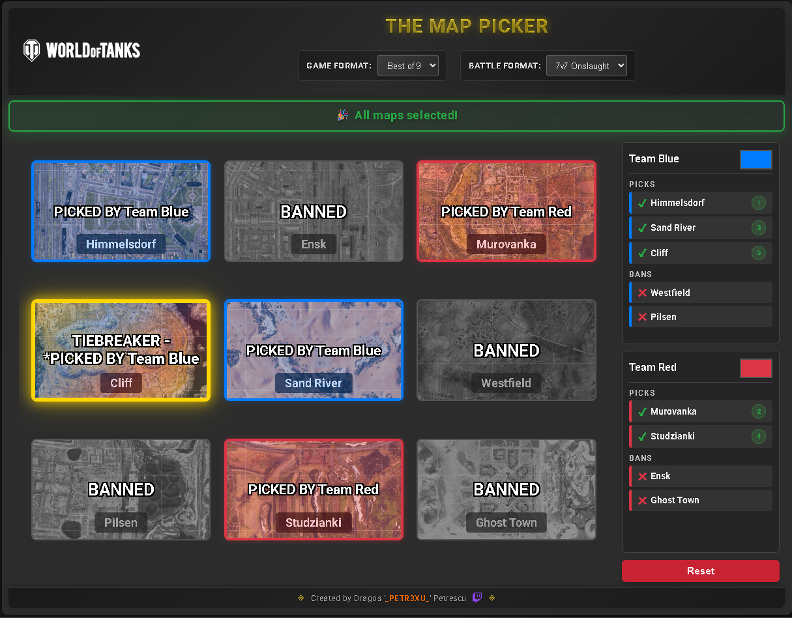

# 🎯 World of Tanks Tournament Map Picker

A professional-grade map picker application designed specifically for World of Tanks competitive tournaments and esports events. This tool streamlines the pick/ban process for tournament organizers, teams, and broadcasters.



## 🌟 Features

### 🎮 Tournament Formats Supported
- **Best of 3 (BO3)**: First to win 2 matches
- **Best of 5 (BO5)**: First to win 3 matches  
- **Best of 7 (BO7)**: First to win 4 matches
- **Best of 9 (BO9)**: First to win 5 matches

### 🗺️ Battle Format Support
- **3v3 Tier X**: Standard competitive format (7 maps)
- **3v3 Onslaught**: Onslaught mode variant (8 maps)
- **5v5 Onslaught**: Extended onslaught format (9 maps)
- **7v7 Onslaught**: Large-scale onslaught battles (9 maps)

### 🎨 Professional Tournament Features
- **Team Customization**: Custom team colors and names
- **Visual Pick/Ban Interface**: Clear visual representation of selected/banned maps
- **Tiebreaker Highlighting**: Special gold styling for decisive maps
- **Real-time Instructions**: Step-by-step guidance for tournament flow
- **Auto-completion**: Smart auto-ban and auto-pick for streamlined process
- **Responsive Design**: Works on all devices and screen sizes

## 🚀 Live Demo

Visit the live application: [WoT Tournament Map Picker](https://dragos20tech.github.io/wot-map-picker)

## 📋 How It Works

### Tournament Flow
1. **Select Formats**: Choose game format (BO3/BO5/BO7/BO9) and battle format
2. **Team Setup**: Customize team names and colors
3. **Pick/Ban Phase**: Teams alternate picking and banning maps according to competitive rules
4. **Tiebreaker**: Final map is highlighted as the potential match decider
5. **Results**: Clear overview of picked maps in play order

### Pick/Ban Sequences

#### Best of 3 (BO3)
- **Sequence**: Team 1 Pick → Team 2 Ban → Team 2 Pick
- **Maps Played**: Maximum 2 maps
- **Requirement**: 4+ maps in pool

#### Best of 5 (BO5)  
- **Sequence**: Team 1 Pick → Team 2 Ban → Team 2 Pick → Team 1 Ban → Team 1 Pick
- **Maps Played**: Maximum 3 maps
- **Requirement**: 6+ maps in pool

#### Best of 7 (BO7)
- **Sequence**: Team 1 Pick → Team 2 Ban → Team 2 Pick → Team 1 Ban → Team 1 Pick → Team 2 Ban → Team 2 Pick
- **Maps Played**: Maximum 4 maps
- **Requirement**: 8+ maps in pool

#### Best of 9 (BO9)
- **Sequence**: Team 1 Pick → Team 2 Ban → Team 2 Pick → Team 1 Ban → Team 1 Pick → Team 2 Ban → Team 2 Pick → Team 1 Ban → Team 1 Pick
- **Maps Played**: Maximum 5 maps
- **Requirement**: 9 maps in pool (perfect fit)

## 🛠️ Installation & Deployment

### Quick Start (GitHub Pages)
1. Fork this repository
2. Go to repository Settings → Pages
3. Set source to "Deploy from a branch" → "main" → "/ (root)"
4. Access your tournament tool at: `https://dragos20tech.github.io/wot-map-picker`

### Local Development
```bash
# Clone the repository
git clone https://github.com/dragos20tech/wot-map-picker.git

# Navigate to project directory
cd wot-map-picker

# Open index.html in your browser
# No build process required - pure HTML/CSS/JavaScript
```

### Alternative Hosting Options
- **Netlify**: Drag and drop deployment
- **Vercel**: Connect GitHub for automatic deployments
- **Firebase Hosting**: Google Cloud infrastructure

## 🎯 Tournament Usage

### For Tournament Organizers
- Use during official matches to ensure fair map selection
- Project on screens for audience visibility
- Maintain consistent competitive integrity
- Record pick/ban history for analysis

### For Teams
- Practice strategic map selection
- Develop pick/ban strategies
- Understand format requirements
- Simulate tournament conditions

### For Broadcasters/Streamers
- Visual tool for explaining pick/ban phase
- Professional presentation for viewers
- Real-time tournament coverage
- Educational content creation

## 🗺️ Supported Maps

### Standard 3v3 Pool
- Himmelsdorf, Prokhorovka, Lakeville
- Ensk, Mines, Cliff, Redshire

### Onslaught Pools
- **3v3**: Himmelsdorf, Ensk, Murovanka, Mines, Cliff, Sand River, Westfield, Pilsen
- **5v5**: Extended pool with Ghost Town, Oyster Bay
- **7v7**: Extended pool with Studzianki, Ghost Town

## 🎨 Customization

### Team Colors
- Click the color picker next to team names
- Real-time preview of selections
- Professional tournament aesthetics

### Adding Maps
Edit `main.js` to add new maps to `ALL_AVAILABLE_MAPS`:
```javascript
{
    name: 'Your Map Name',
    imageUrl: 'path/to/map/image.jpg'
}
```

## 🏆 Tournament Standards

This tool follows standard competitive World of Tanks tournament formats used in:
- ESL tournaments
- World Championship Series
- Regional competitive events
- Community tournaments

## 📱 Browser Support

- ✅ Chrome/Chromium (Recommended)
- ✅ Firefox
- ✅ Safari
- ✅ Edge
- 📱 Mobile browsers supported

## 🤝 Contributing

We welcome contributions from the World of Tanks community!

1. Fork the repository
2. Create a feature branch: `git checkout -b feature/amazing-feature`
3. Commit changes: `git commit -m 'Add amazing feature'`
4. Push to branch: `git push origin feature/amazing-feature`
5. Open a Pull Request

### Contribution Ideas
- Additional map pools
- New tournament formats
- UI/UX improvements
- Mobile optimization
- Internationalization

## 📄 License

MIT License - feel free to use for tournaments, streams, and community events.

## 🎮 About World of Tanks

World of Tanks is a massively multiplayer online game developed by Wargaming, featuring mid-20th century era combat vehicles. This tool supports the competitive esports scene surrounding the game.

## 🔗 Links

- **Live App**: [WoT Tournament Map Picker](https://dragos20tech.github.io/wot-map-picker)
- **Issues**: [Report bugs or request features](https://github.com/dragos20tech/wot-map-picker/issues)
- **World of Tanks**: [Official Website](https://worldoftanks.com/)

---

**Created for the World of Tanks competitive community** 🎖️

*"In tournament play, every map matters. Make your picks count."*